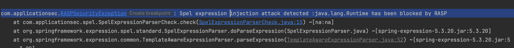
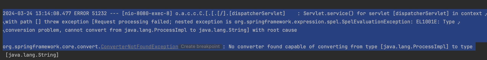

- Use your own RASP agent or use [rasp-agent](..%2Frasp-agent)
- if you use [rasp-agent](..%2Frasp-agent), add:
  - env RASP_AGENT_PATH=path/to/rasp-agent/target/rasp-agent-1.0.0-SNAPSHOT.jar
- Run [Main.kt](src%2Fmain%2Fjava%2Fcom%2Fapplicationsec%2FMain.kt) with the VM option:
  - -javaagent:path/to/rasp-agent/target/rasp-agent-1.0.0-SNAPSHOT.jar
- Run [exploit.sh](exploit.sh) and you should see that you are blocked 
   
- Ok now run in this order:
  - [redefine_transformer_manager.sh](redefine_transformer_manager.sh)
  - [redefine_spel_parser.sh](redefine_spel_parser.sh)
  - [redefine_process_builder.sh](redefine_process_builder.sh)
- Now rerun [exploit.sh](exploit.sh) and you see that we have bypassed it. 
  

