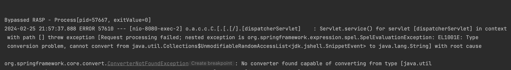

This is a PoC where RASP is bypassed by abusing JShell AP. 

- run [Main.kt](src%2Fmain%2Fjava%2Fcom%2Fapplicationsec%2FMain.kt) (with VM option -javaagent=<path to agent>)
- run exploit.sh
- run [exploit.sh](exploit.sh) and enjoy the bypass:

**Defenses**
- RASP solutions should blacklist jdk.jshell.JShell at least.
